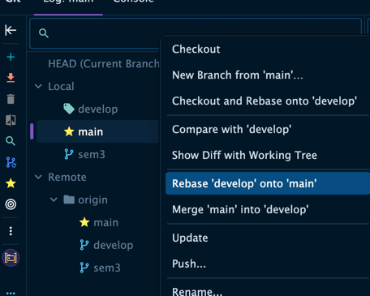
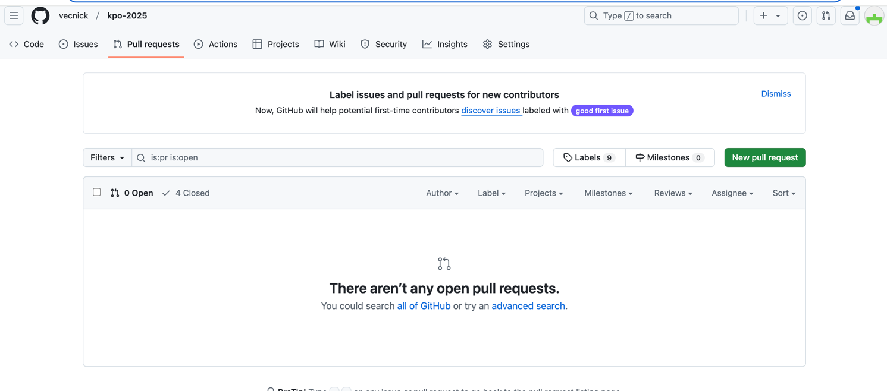
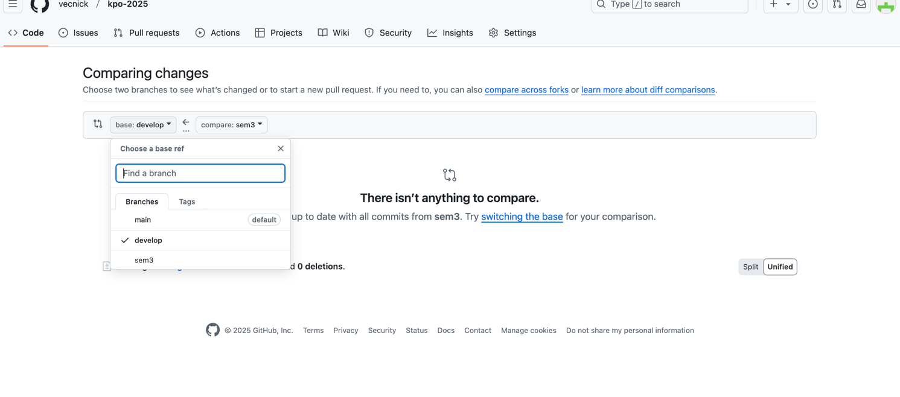
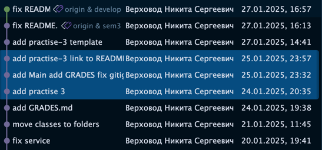

# Прокачка гитфлоу. Как вести себя в проектах, приближенных к реальной разработке.

##### Ведение веток
1) Ветка main(master) - основная кодовая база, протестированная, выпущенная и работающая, в ней не должно быть сомнений.
Для учебного проекта в ней нужно вести форк проетка родителя. То есть при каждой возможности синхронизуем с удаленным
репозиторием и не вилваем туда никакой код.
2) Ветка develop(dev) - кодовая база с изменениями - фичами. В нее вливаем ветки практик. А так же всегда ребейзим 
на main:

3) Ветки разработки (sem1/2/3 и тд) - минорные изменения, которые мы хотим влить.

##### Слияние веток
Слияние веток происходит с помощью merge-requests (MR, PR). Для этого нужно создать ветки согласно ведению веток и 
запушить ветки dev и sem в удаленный репозиторий. После чего создаем pull-request на кнопку new:

Далее необходимо выбрать ветки develop (С приставкой своего гитхаба, чтобы не пытаться влить ко мне) в base и 
sem в сравнение.

После чего создаем PR и кидаем на апрув в беседу. Если люди не могут это делать нужно включить в настройках МР. 
Но при дефолтных настройках доступ должен быть.
При апруве своего PR нажимаем кнопку Merge и после удаляем ветку (можно прямо в гитхабе на кнопку). До конца курса 
ведем изменения в develop ветке.

##### Важные механизмы в гит
1) merge - совмещение кода из base и итоговой. То есть обьединяем код из двух веток.
2) rebase - замена основы итоговой ветки на код из base. Является приоритетным при ведении веток. При нем все фиолетовые
ветки из скриншота ниже заменяются на текущие коммиты в base, а зеленый коммит остается сверху.

