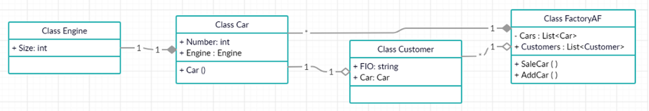

# Занятие 1. Отношения между классами и объектами

Студенты ВШЭ разработали инновационный автомобиль, сердцем которого стал прорывной педальный двигатель, работающий на силе духа и ног автовладельца. В связи с большим спросом на данное изобретение, студенты обратились к вам с просьбой автоматизировать процесс учета их продукции.

## Описание информационной системы

Информационная система должна вести учет продукции – собранные студентами педальные автомобили и контролировать очередь из желающих приобрести данное ноу-хау. В разрабатываемой информационной системе важно учесть, что инновационный автомобиль не предполагается продавать без революционного педального двигателя, а также любой произведенный автомобиль изначально становится собственностью НИУ ВШЭ.

Люди, которые желают приобрести данное чудо техники, как-то жили и без этого изобретения, а следовательно они должны существовать вне зависимости от того, дождутся они своей очереди или нет.

## Технические требования

Класс `Engine` содержит такую характеристику как «размер педалей» и имеет ассоциацию, реализованную в виде композиции с классом Car.

Класс `Car`, помимо включенного в него класса `Engine`, имеет порядковый номер произведенного автомобиля.

Класс `Customer` содержит ссылку на класс `Car` (между классами ассоциация в виде агрегации), а также ФИО.

Класс `HseCarFactory` содержит коллекцию объектов `Customer` (между классами ассоциация в виде агрегации) и коллекцию объектов `Car` (связь в виде композиции).
В данном классе реализовать метод `SaleCar()`, который должен «пробежаться» по всем клиентам в очереди на покупку и по возможности (при наличии) вручить каждому педальный автомобиль.
При этом «врученный» автомобиль удаляется из коллекции автомобилей предприятия автотранспортного факультета.

В случае, если всем желающим выдали автомобиль, но они все равно остались на складе, то происходит их ликвидация (очистка коллекции автомобилей).

## Тестирование

Продемонстрируйте работу вашей системы. Создайте предприятие автотранспортного факультета, добавьте несколько автомобилей, а также желающих приобрести данные автомобили. Выведите информацию об автомобилях на складе и людях до метода SaleCar() и после отработки данного метода.

## Домашняя работа
1. Форк проекта к себе в гит (просто запустить, чтобы не тратить на это время на паре).
2. Выписка себе в гит определений из [определений](./DEFINITIONS.md).

 

Ссылки

1. https://metanit.com/sharp/patterns/1.2.php
2. https://javarush.com/groups/posts/principy-oop

